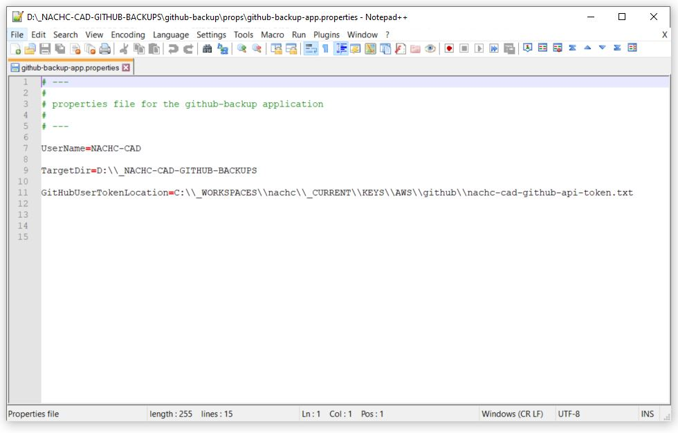

# github-backup
The github-backup project is a tool that can be used to create a local backup of all repositories identified by a github token.  
# Introduction
The github-backup project is a tool that can be used to create a local backup of all repositories identified by a github token.  
To use the tool, download the latest zip file from the releases page of this project, extract the contents, update the configuration file, and add a chron job to call the github-backup.jar file using java.  Detailed instructions are given below.  
The current version of this tool uses a naming convention to create a folder for daily backups using a yyyy-MM-dd format.  
On the 22nd day of each month, a monthly backup will be created in the MONTHLY folder and all backups from previous months will be deleted (leaving 22 daily backups).  
Details on installation and use are given below.  
# Instalation and Use
## Get a github token
Instructions on getting a github token are at https://nachc-cad.github.io/fhir-to-omop/pages/navbar/how-tos/developer-how-tos/git-token/GitToken.html
## Download and Install
Download the github-backup.zip file from the latest release.  

  
Create a home directory for your backups.  For this example we will use D:\_NACHC-CAD-GITHUB-BACKUPS.  Copy the github-backup.zip file to this directory and extract the contents then delete the .zip file (or move it inside of the github-backup folder if you want to keep it).  

 

  
Navigate to the &lt;backup-home&gt;/github-backup/props/github-backup-app.properties file and update with your values.  
 
<ul>
	<li>
		UserName is your Github handle
	</li>
	<li>
		TargetDir is the directory where you would like your backups to be created
	</li>
	<li>
		GitHubUserTokenLocation points to the file where you have stored your Github token.  
	</li>
</ul>
 

  

  

## Run from command line
The github-backup application can be run from the command line.  
Open a command prompt and navigate to the &lt;backup-home&gt;/github-backup directory and run:
  
java -jar github-backup.jar
 

  
When the backup has finished there should be a new folder that contains full backups of all of your repositories in your &lt;backup-home&gt;/github-backup directory named with the current date in yyyy-MM-dd format similar to what is shown below.  
 

## Run as a Scheduled Job
Windows Task Scheduler can be used to set up a daily backup of all of your Github repositories by doing the following.  
<h3>Open Task Scheduler</h3>
Open Task Scheduler by Searching for "Task Scheduler" in the windows search box then select "Create Basic Task...".
 

  
Give the scheduled task a name.
 

  
Select daily
 

  
Select a time
 

  
Select start a program
 

  
Enter the location of your java.exe and the other information as shown below, using your installation location for the jar file in the arguments field (e.g. we are using D:\_NACHC-CAD-GITHUB-BACKUPS\github-backup for this example as this is where we installed the github-backup.jar file and its dependencies when we extracted the github-backup.zip file).  
 

  
Select "Finish"
 

  

